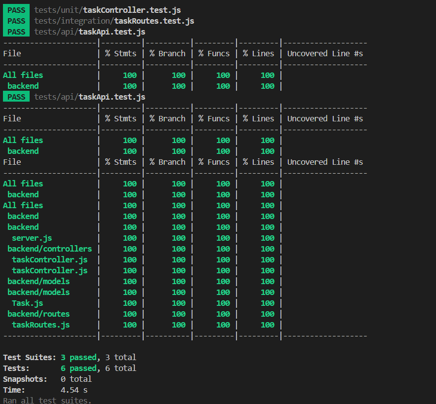

# Task Manager API

A scalable and modular RESTful API built using **Node.js**, **Express**, and **MongoDB**, designed to manage tasks with full **CRUD** support and a robust test suite with **Jest** and **Supertest**.

---

## Overview

This project serves as a foundational API service for managing tasks. It includes:

- A clean separation of concerns between routes, controllers, and models.
- MongoDB integration using Mongoose ODM.
- Comprehensive testing including unit, integration, and API tests.
- >80% test coverage to ensure code reliability and stability.

---

## Tech Stack

| Layer        | Technology           |
|--------------|----------------------|
| Runtime      | Node.js              |
| Web Framework| Express.js           |
| Database     | MongoDB + Mongoose   |
| Testing      | Jest, Supertest      |
| Dev Tools    | Nodemon, dotenv      |

---

## API Endpoints

| Method | Endpoint         | Description           | Payload                  |
|--------|------------------|-----------------------|--------------------------|
| GET    | `/api/tasks`     | Fetch all tasks       | –                        |
| POST   | `/api/tasks`     | Create a new task     | `{ title, description }`|
| PUT    | `/api/tasks/:id` | Update a task by ID   | `{ title, status }`      |
| DELETE | `/api/tasks/:id` | Delete a task by ID   | –                        |

---

## Getting Started

### 1. Clone Repository

```bash
git clone https://github.com/your-username/task-manager-api.git
cd task-manager-api
npm install
````

### 2. Environment Setup

Create a `.env` file:

```env
PORT=5000
MONGO_URI=mongodb://localhost:27017/taskmanager
```

### 3. Start Server

```bash
npm start
```

The server will be available at: `http://localhost:5000/api/tasks`

---

## Testing

Run all tests:

```bash
npm test
```

### Test Types

* **Unit Tests**: Validate business logic.
* **Integration Tests**: Ensure controllers and DB interact correctly.
* **API Tests**: Simulate full HTTP request/response cycle.

### Test Coverage

> Achieved **100%** code coverage across statements, branches, functions, and lines.

**Coverage Report:**



---

## Key Learnings

* Built and tested scalable Node.js APIs.
* Practiced both mocking and real DB integration testing.
* Leveraged **Jest** and **Supertest** to validate API robustness and performance.
* Understood real-world test automation and coverage strategies.

